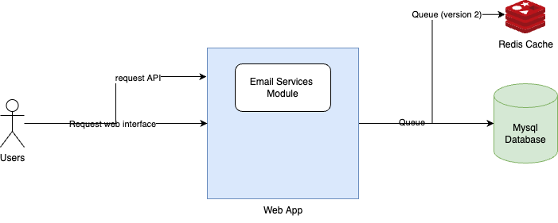
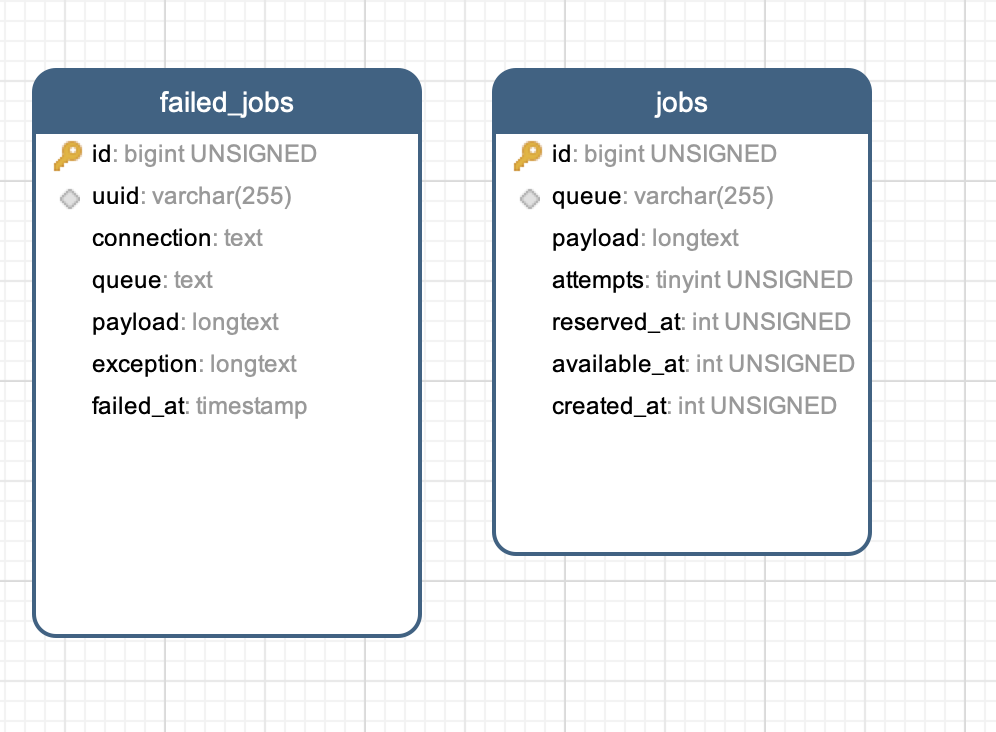
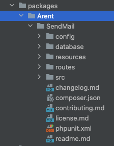
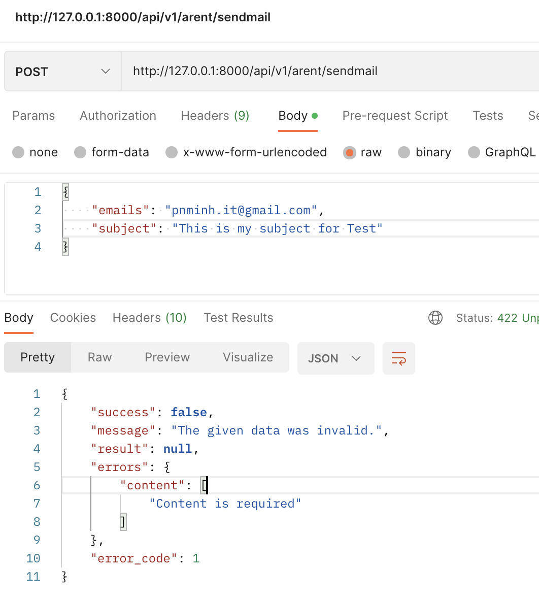
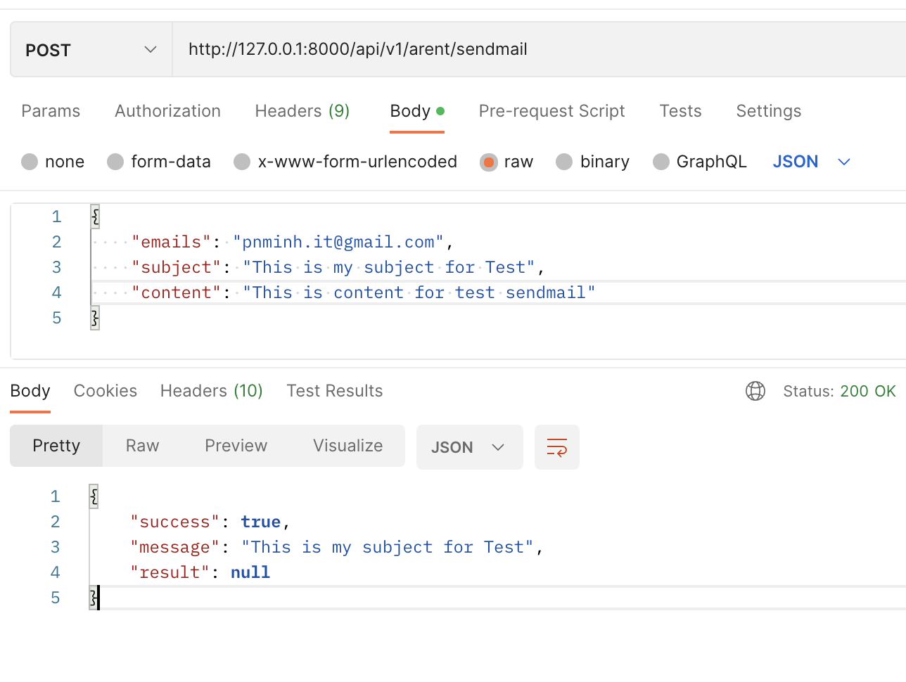
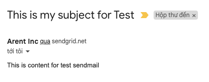

## Email Service

Create a service that accepts the necessary information and sends emails. It should provide an abstraction between two different email service providers. If one of the services goes down, your service can quickly failover to a different provider without affecting your customers.
> Email Providers using in project:
- SendGrid
- Mailgun

## How it works
> 

Table Structure Jobs sendmail
> 
- PHP Laravel 8.x Framework
- Database: mysql 8.x maybe mariadb 10.7
- Email Server is a standalone module built into the Laravel Framework
- Deploy to EC2 with: nginx, php-fpm, mariad

> 
- This module supports sending on web interface and API
  - Web Interface: http://127.0.0.1:8000/arent/sendmail
  - API: http://127.0.0.1:8000/api/v1/arent/sendmail

- Version 1 support:
  - [x] Send mail with sendgrid and mailgun
  - [x] if Sendgrid fails, it will automatically switch to send by Mailgun
- Version 2 (coming soon): fixed some outstanding issues in version 1
  - manage smtp list in database (current version is assigned in config .env)
  - use redis instead of database (currently) as queue to increase speed
  - connect to Sendgrid/mailgun API for more detailed error tracking

## Getting started
Setting config
```
$ cp .env.example .env
# change content file .env connect to database
... 
DB_CONNECTION=mysql
DB_HOST=127.0.0.1
DB_PORT=3306
DB_DATABASE=arent-sendmail
DB_USERNAME=root
DB_PASSWORD=123456789
...

# config queue for sendmail, current i using database
...
QUEUE_CONNECTION=database
...
# config smtp mail server
MAIL_MAILER=smtp
MAIL_HOST=smtp.sendgrid.net
MAIL_PORT=587
MAIL_USERNAME=apikey
MAIL_PASSWORD=<api key of sendgrid>
MAIL_ENCRYPTION=tls
MAIL_FROM_ADDRESS=<input mail of domain sendmail>
MAIL_FROM_NAME="Arent Inc"

MAIL_MAILER_2=smtp
MAIL_HOST_2=smtp.mailgun.org
MAIL_PORT_2=587
MAIL_USERNAME_2=<input username of mailgun>
MAIL_PASSWORD_2=<input password of mailgun>
MAIL_ENCRYPTION_2=tls
MAIL_FROM_ADDRESS_2=<input mail of domain sendmail>
MAIL_FROM_NAME_2="Arent Inc"
...

$ php artisan key:generate

# run migrate database
$ php artisan migrate

# run queue in background for job sendmail => open in other tenimal
$ php artisan queue:work  
```

Install dependence libs
```
$ composer install
```

Run start server for developer
```
$ php artisan serve
```

## Demos
> 
> 
> 
